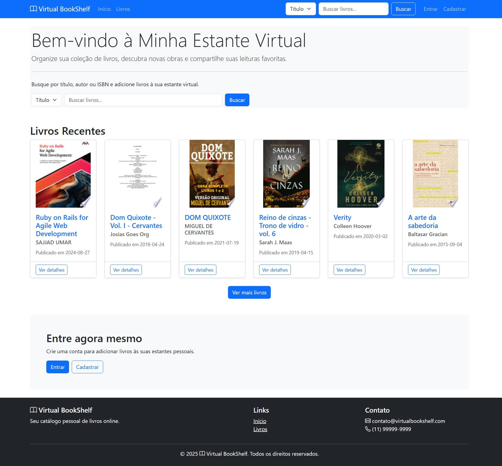
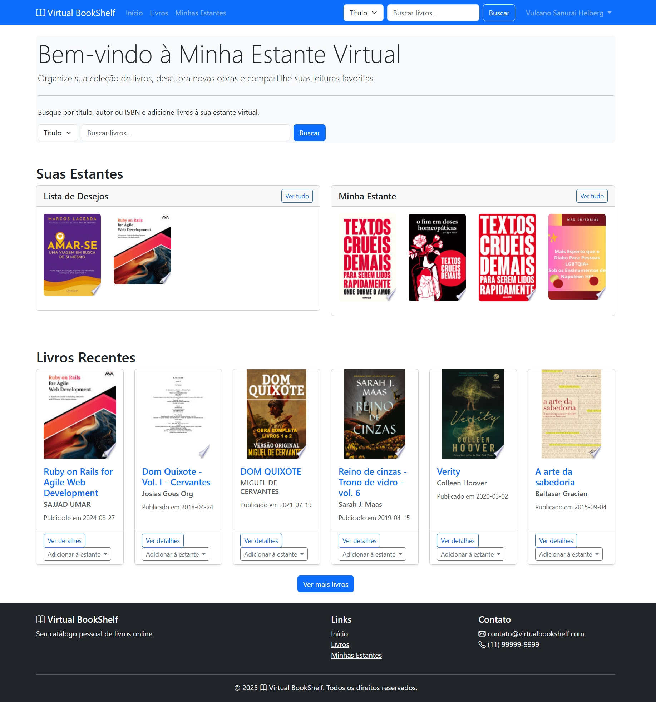
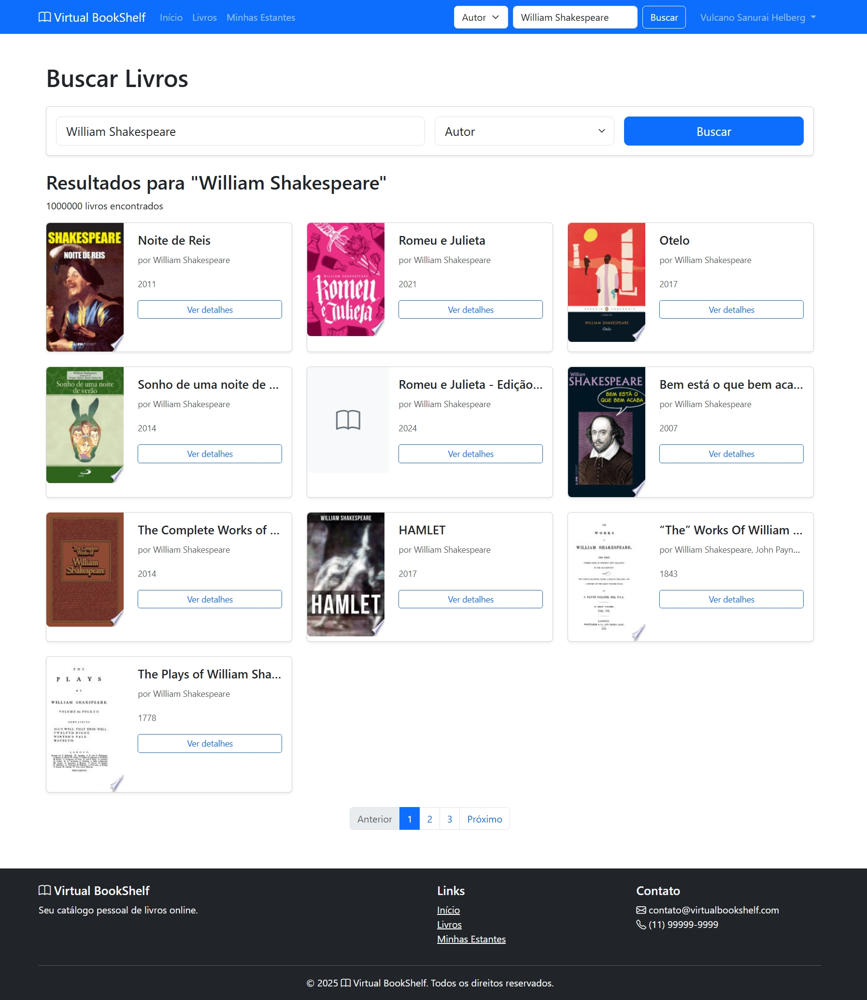
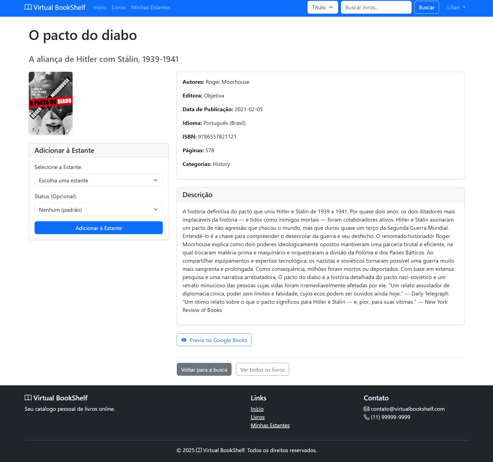
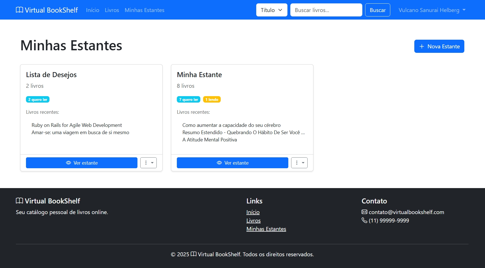
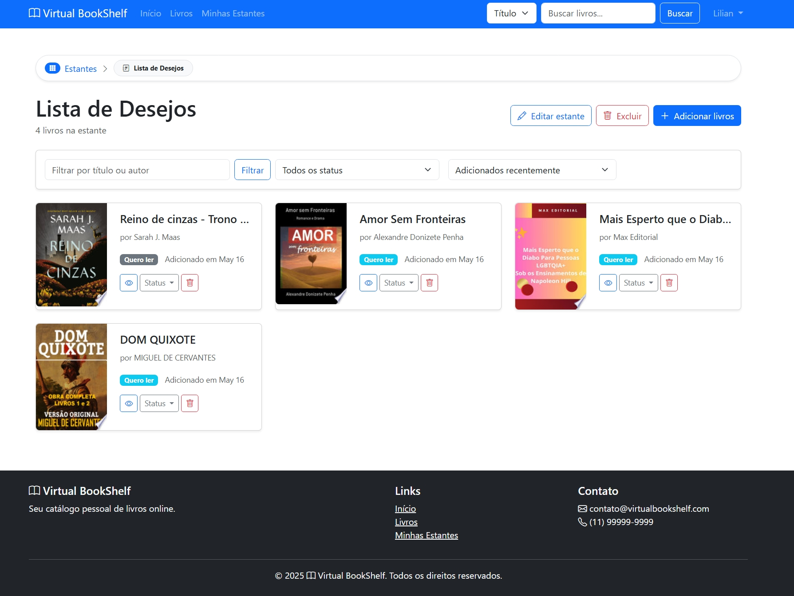
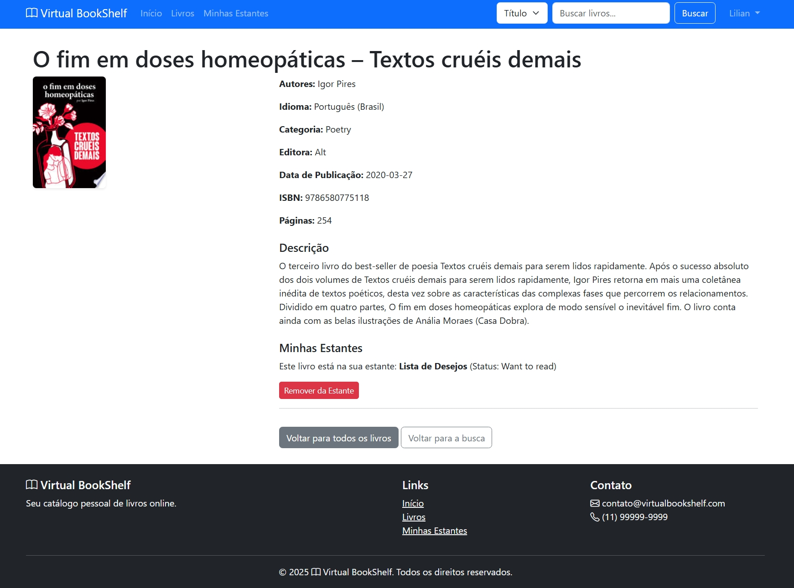

## Virtual BookShelf

Uma aplicação web desenvolvida com Ruby on Rails para gerenciar e organizar sua coleção de livros.
Com a Minha Estante Virtual, você pode pesquisar livros usando a API do Google Books, criar estantes personalizadas e acompanhar seu progresso de leitura.

## Algumas Views

. Home Index


. Home Index Usuário


. Resultado da Busca


. Adiciobar Livro a Estante


. Minhas Estantes


. Estante do Usuario


. Detalhe Livro na Estante


🚀 Funcionalidades

    . 📚 Pesquisa de livros: Busque por título, autor ou ISBN utilizando a API do Google Books
    . 📖 Visualização detalhada: Informações completas sobre cada livro, incluindo sinopse, autor, editora e mais
    . 📁 Estantes personalizadas: Crie e organize estantes personalizadas para categorizar suas leituras
    . ✅ Status de leitura: Mantenha o controle do seu progresso (Quero ler, Estou lendo, Já li)
    . 👤 Autenticação segura: Sistema de login com JWT para proteger seus dados
    . 📱 Design responsivo: Interface amigável em dispositivos desktop e móveis

⭐️ Algumas Regras de negócio ⭐️

    . Para acesso as funcionalidades, usuário cadastrado e logado.
    . A busca por livros, será por titulo, autor e ISBN
    . Usar a API GoogleBooksApi para busca de livros
    . O limite do resultado de busca, sera de acordo com os parametros da API
    . Não pode haver duplicação de livros em uma mesma estante
    . Não havera limites de estantes
    . A aplicação iniciará com 2 estantes (Lidos e Lista de Desejos)
    , Ao adicionar um livro a uma estante, este livro sera adicionado a lista de livros
    . A lista de livros de livros não terá livros duplicados
    . Um livro da lista de livros pode ser adicionado a uma estante
    . Um livro de uma estante, pode ter o status de "want_to_read, reading, read", o default sera "want_to_read"

🔧 Tecnologias Utilizadas

    . Ruby on Rails 7: Framework web robusto e ágil
    . PostgreSQL: Banco de dados relacional
    . Bootstrap 5.3.3: Framework CSS para interface responsiva
    . JWT: Autenticação segura via JSON Web Token
    . Google Books API: Para busca e importação de dados de livros
    . Turbo & Hotwire: Para atualizações dinâmicas da interface

📋 Pré-requisitos

    . Ruby 3.3.4
    . Rails 7.2.1
    . PostgreSQL 12+
    . Node.js 20.18
    . Yarn 1.22+

🔨 Instalação

1. Clone o repositório

   ```
   bash
   git clone https://github.com/vulcanobr/virtual-bookshelf.git
   cd virtual-bookshelf
   ```

2. Instale as dependências

   ```
     bash
     bundle install
     yarn install
   ```

3. Configure as variáveis de ambiente (crie um arquivo .env na raiz do projeto)
   ```
     GOOGLE_BOOKS_API_KEY=sua_chave_api_google_books
     JWT_SECRET_KEY=use_uma_chave_segura_e_aleatoria_aqui
     JWT_EXPIRATION_TIME=24
   ```
4. Configure o banco de dados

   ```
    bash
    rails db:create
    rails db:migrate
   ```

5. Inicie o servidor

   ```
    bash
    bin/dev
   ```

6. Acesse a aplicação em http://localhost:3000

🖥️ Como Usar

Autenticação

    1. Se tem uma conta, Entrar
    2. Senão tem uma conta, Cadastrar

Pesquisa de Livros

    1. Na pagina Principal e logado
    2. Digite o título, autor ou ISBN do livro desejado
    3. Selecione o tipo de busca no menu suspenso (Título, Autor ou ISBN)
    4. Clique em "Buscar" para ver os resultados
    5. Clique em "Ver detalhes" para ver informações completas sobre o livro
    6. Para adicionar à sua estante, escolha uma estante e o status de leitura

Gerenciamento de Estantes

    1. Acesse "Minhas Estantes" no menu principal
    2. Clique em "Nova Estante" para criar uma estante personalizada
    3. Dê um nome e descrição à sua estante
    4. Adicione livros à estante através da página de detalhes de cada livro
    5. Gerencie suas estantes removendo livros ou alterando seu status de leitura

Autenticação

    POST /login: Autenticar usuário e obter token JWT
    POST /register: Registrar novo usuário

Livros

    GET /books: Lista todos os livros
    GET /books/{id}: Detalhes de um livro específico
    GET /books/search: Pesquisar livros

Estantes

    GET /bookshelves: Lista todas as estantes do usuário autenticado
    GET /bookshelves/{id}: Detalhes de uma estante específica
    POST /bookshelves: Criar uma nova estante
    PUT /bookshelves/{id}: Atualizar uma estante existente
    DELETE /bookshelves/{id}: Excluir uma estante
    POST /bookshelves/{id}/add_book: Adicionar livro à estante
    DELETE /bookshelves/{id}/remove_book: Remover livro da estante

📝 Estrutura do Projeto

    virtual-bookshelf/
    ├── app/
    │ ├── controllers/ # Controladores da aplicação
    │ ├── models/ # Modelos de dados
    │ ├── views/ # Views da interface
    │ ├── services/ # Serviços (como GoogleBooksApiService)
    │ └── helpers/ # Helpers de views
    ├── config/ # Configurações da aplicação
    ├── db/ # Configurações do banco de dados e migrações
    └── ... # Outros arquivos e diretórios padrão do Rails

🚀 Guia técnico ==> Que explica mais detalhadamente a [arquitetura do projeto](TECHNICAL_GUIDE.md).

🚀 Guia rápido de [instalação](QUICKSTART.md).

📜 Licença

    Este projeto está licenciado sob a licença MIT.

🙏 Agradecimentos

    Google Books API pela disponibilização dos dados de livros
    A todos os contribuidores que dedicaram tempo para melhorar este projeto

⭐️ Desenvolvido por Marcelo Severo ⭐️

    Se você gostou deste projeto, não se esqueça de dar uma estrela no GitHub!
